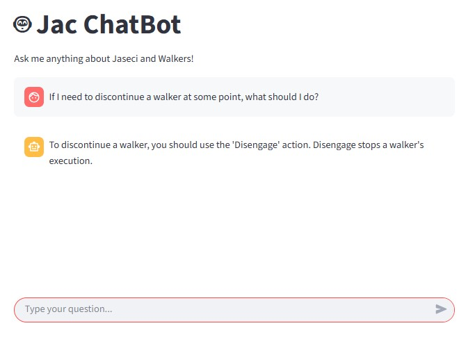
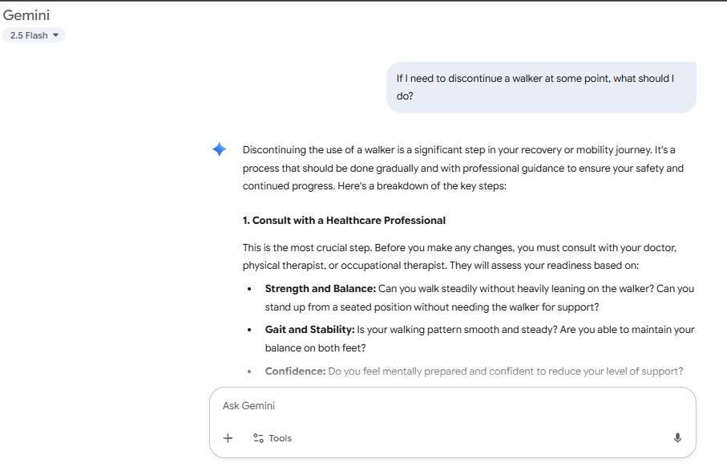

# 🤖 JAC ChatBot 

This project is an **AI-powered RAG (Retrieval Augmented Generation) chatbot** built using **Jac** and **Streamlit**, developed by Team **LLMinators**. It uses Supabase for vector storage and Google's Gemini API for embeddings and intelligent document-based responses.

---

## 📌 Overview

The **JAC ChatBot** is a sophisticated web-based conversational AI that:

* Ingests and processes markdown documents from your knowledge base.
* Performs **vector similarity search** using Supabase pgvector for relevant context retrieval.
* Provides **context-aware responses** using Google's Gemini AI with retrieved document snippets.
* Offers an **interactive chat interface** built with Streamlit for seamless user experience.
* Demonstrates **superior performance** compared to basic AI models through RAG architecture.

It's an intelligent solution for document-based question answering, knowledge management, and educational content interaction.

---

## 🔍 Key Features

* 🚀 **Document Ingestion**: Automatically processes markdown files and creates vector embeddings.
* 🔍 **Vector Search**: Uses Supabase pgvector for fast and accurate similarity search.
* 💬 **Interactive Chat**: Clean, user-friendly Streamlit interface for conversations.
* ✅ **Context-Aware**: Retrieves relevant document chunks before generating responses.
* 🧠 **Smart Responses**: Powered by Google's Gemini Pro for high-quality text generation.
* 📊 **Performance Comparison**: Demonstrates improved accuracy over basic AI responses.
* 🔄 **Real-time Processing**: Fast query processing and response generation.
* 📚 **Knowledge Base**: Supports multiple document chapters and sections.

---

## 🔧 Technologies & Tools Used

* **Jac Language** – Core logic and RAG implementation
* **Google Gemini AI** – Embeddings generation and text completion
* **Supabase** – Vector database with pgvector extension
* **Python 3.8+** – Backend runtime environment
* **Streamlit** – Interactive web interface for chat
* **LangChain** – Document processing and text splitting
* **VS Code** – Recommended IDE

> 
> 
> 
> 
> 

---

## ⚙️ How It Works

1. **Document Processing**: Markdown files are split into chunks and embedded using Gemini's embedding model.
2. **Vector Storage**: Embeddings are stored in Supabase with pgvector extension for efficient similarity search.
3. **Query Processing**: User queries are embedded and matched against stored document embeddings.
4. **Context Retrieval**: Most relevant document chunks are retrieved based on semantic similarity.
5. **Response Generation**: Retrieved context is used to generate accurate, contextual responses with Gemini Pro.
6. **Interactive Interface**: Users interact through a clean Streamlit web interface.

---

## 🧰 Setup & Run Guide (VS Code)

### ✅ Requirements

* Python 3.8+
* Supabase account and project
* [JacLang CLI](https://jaclang.com/docs/getting-started/installation/)
* All dependencies listed in `requirements.txt`
* Gemini API Key: [Get it here](https://makersuite.google.com/app)

---

### 🔐 Set Up Environment Variables

Create a `.env` file with your credentials:

```env
SUPABASE_URL=your_supabase_url
SUPABASE_KEY=your_supabase_anon_key
GEMINI_API_KEY=your_gemini_api_key
```

**Windows PowerShell (Alternative)**:
```powershell
$env:SUPABASE_URL="your_supabase_url"
$env:SUPABASE_KEY="your_supabase_anon_key"  
$env:GEMINI_API_KEY="your_gemini_api_key"
```

---

### 🏗️ Supabase Database Setup

1. Go to your Supabase project dashboard
2. Navigate to SQL Editor
3. Run the SQL script from `supabase_setup.sql`

This will:
- Create the `docs` table
- Enable the pgvector extension  
- Create the vector similarity search function
- Add necessary indexes

---

### 🚀 Run the Project Locally

**1. Clone the Repository**:
```bash
git clone https://github.com/SahanUday/Jac_ChatBot.git
cd Jac_ChatBot
```

**2. Install Dependencies**:
```bash
pip install -r requirements.txt
```

**Or install manually**:
```bash
pip install jaclang mtllm gitpython streamlit requests python-dotenv supabase sentence-transformers langchain numpy
```

**3. First Time Setup (Ingest Documents)**:
```bash
python main.py
# Choose option 1 to ingest documents
```

**4. Start the Chatbot**:
```bash
python main.py
# Choose option 2 to start the chatbot
```

**Alternative: Launch with Streamlit**:
```bash
streamlit run app.py
```

**Then open your browser and visit**:
```bash
http://localhost:8501
```

---

## 📊 Performance Comparison

Here's a visual comparison showing how our **RAG-enhanced chatbot** outperforms basic AI responses:

### 🔄 RAG Architecture vs Basic Gemini Flash

| **RAG-Enhanced Response** | **Basic Gemini Flash Response** |
|:-------------------------:|:--------------------------------:|
|  |  |

> 🧠 **Key Advantages of RAG Architecture**:
> - **Contextual Accuracy**: Responses based on your specific documents
> - **Domain Knowledge**: Understands your content better than general AI
> - **Factual Reliability**: Reduced hallucination through document grounding
> - **Customizable**: Adapts to your knowledge base and use case

---

## 🧪 Usage Guide

1. **Document Ingestion**: Run option 1 to load and embed all markdown files from the `docs/` directory
2. **Interactive Chat**: Run option 2 to start chatting with the bot  
3. **Ask Questions**: The bot will search for relevant context and provide answers based on your documents
4. **Context Awareness**: Each response includes relevant document snippets for transparency

---

## 📁 Project Structure

```
Jac_ChatBot/
├── main.jac                # Main JAC application logic
├── app.py                  # Streamlit frontend interface
├── saveEmbeddings.py       # Document processing and embedding
├── main.py                 # CLI chatbot application
├── .env                    # Environment variables
├── README.md               # This file
├── LICENSE                 # Project license
├── assets/                 # Demo images and media
│   ├── RAGarc_base_response.jpg
│   └── geminiflash_response.jpg
├── docs/                   # Knowledge base markdown files
│   ├── chapter_0.md
│   ├── chapter_1.md
│   └── ... (chapters 2-20)
└── mydatabase/             # Local database storage
    └── jaseci/
        └── node.collection
```

---

## 🤝 Contribution

We welcome contributions to expand features like:
* 📊 Chat history and conversation memory
* 🔍 Advanced search filters and ranking
* ⏱️ Real-time document updates  
* 🔐 User authentication and personalization
* 📈 Analytics and usage insights

Fork the repo, create a feature branch, and submit a pull request!

---

## 🛠 Built With

🧬 **JacLang** – for core RAG logic and walker definitions  
🤖 **Google Gemini Pro** – for embeddings and text generation  
🗄️ **Supabase** – for vector database and similarity search  
🐍 **Python 3.8+** – used for backend processing  
🖥️ **Streamlit** – clean and responsive frontend UI  
🦜 **LangChain** – for document processing and text splitting

---

## 🔧 Troubleshooting

- Ensure all environment variables are set correctly in `.env` file
- Make sure the Supabase database setup script has been run successfully  
- Check that the `docs/` directory contains markdown files
- Verify your Gemini API key has sufficient quota and permissions
- Ensure Supabase project has pgvector extension enabled
- Check Python version compatibility (3.8+ required)

---

## 📜 License

This project is licensed under the MIT License.